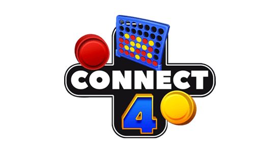

# Connect Four Game
- This is a recreation of classic Four game in html5, css3 and javascript.
- View it [here](https://rededge.is-a.dev/connect-four).

  

### 🔗 Link: https://rededge.is-a.dev/connect-four/

### Made with
- HTML5
- CSS3
- JavaScript

## Running
### Running `online`
- open a browser window
- and go to https://rededge.is-a.dev/connect-four

### Running `offline`
- go to the [releases](https://github.com/RedEdge967/connect-four/releases) of this repo
- download the latest release
- It will be a zip file
- extract it
- run `index.html` file in your web browser

### Gameplay

https://user-images.githubusercontent.com/91379432/165659980-8e5f4b3f-d0fd-4afe-9e90-3f0454b6c278.mp4

## Can I contribute?
- Sure. Open an issue, point out errors and what not, wanna fix something yourself? open a PR and I really appreciate it.

> ### If you like this project, don't forget to give a star. fork this add your commits and open a PR to make this more advanced. Thank you!
